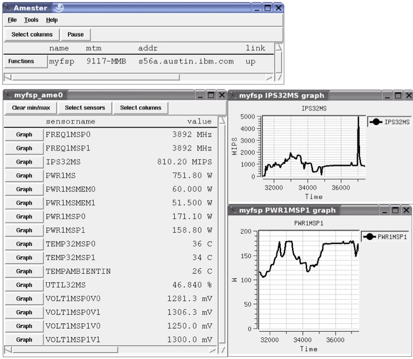

<!--
(C) Copyright IBM Corporation 2011, 2016
-->
# **AMESTER**
Automated Measurement of Systems for Temperature and Energy Reporting

----

1. [Overview](#overview)
2. [Quick Start](#quick-start)
3. [Documentation](#documentation)
4. [Maintainer](#maintainer)

## Overview

Automated Measurement of Systems for Temperature and Energy Reporting (AMESTER)
is a software tool to remotely collect power, thermal, and performance metrics
from IBM servers. It has interfaces for BladeCenter, POWER, and x86 rack-mount
systems. It connects to OpenPOWER systems by accessing the service processor
firmware. In this way, it does not use any of the processing cycles of the
system POWER processor and has no impact on performance. AMESTER is generally
run on a separate system from the OpenPOWER system under investigation. In this
way, it can be used to connect to several systems simultaneously and collect
metrics.

AMESTER is written in [Incr TCL] and is fully scriptable. This allows users to
write custom data collection programs and control the GUI to build
special-purpose demonstrations. AMESTER supports a headless mode for unattended
data collection.

## Quick Start

Getting started with OpenPOWER systems

### Step 0: Install ipmitool

Install ipmitool on the system where you run AMESTER. At this time,
AMESTER depends on using the external ipmitool program to send
messages to the OpenPOWER system.  Linux distributions commonly
install ipmitool by default.

### Step 1: Build AMESTER

    ./autogen.sh
    ./configure
    make

The AMESTER binary will be under the `build/` directory.

### Step 2: Run AMESTER

In the Linux shell

    amester

In the AMESTER GUI

1. From the AMESTER main screen, select "File"
2. select "Connect to..."
3. select "OpenPOWER..."
4. Enter the BMC IP address, IPMI userid, and IPMI password
   and click "Connect". Wait a few seconds for connection.
5. In the AMESTER main screen, select Function -> Sensors...
6. Select "Select sensors". You should see a list of sensors.
7. Click "PWR250US" to see the system power consumption sensor that is
   internally updated every 250 microseconds on POWER8 systems.  (To select
   many sensors quickly, you can mouse-down and drag over many sensor names.)
8. Select OK.
9. You should see sensor values in the sensor window updating.
10. Click "Graph" next to any sensor in the sensor window.

## Documentation
* [User Manual](vfs/doc/manual.txt)
* [README](vfs/doc/README.txt) - Contains change log
* [OCC commands](https://github.com/open-power/docs/blob/master/occ/OCC_ipmitool_sensors.pdf):
  Details on the IPMI commands Amester uses. Useful for rolling your own
  metrics collection solution.

## Maintainer
Sheldon Bailey (baileysh@us.ibm.com)
